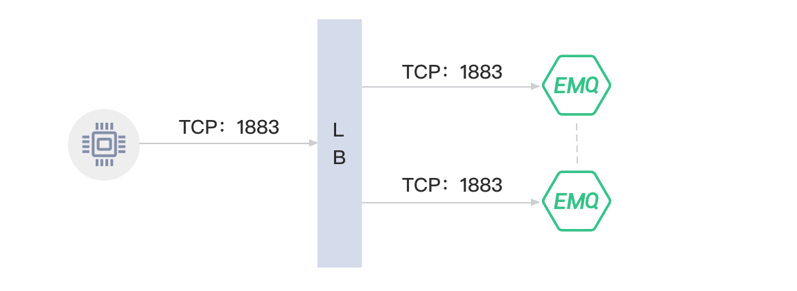
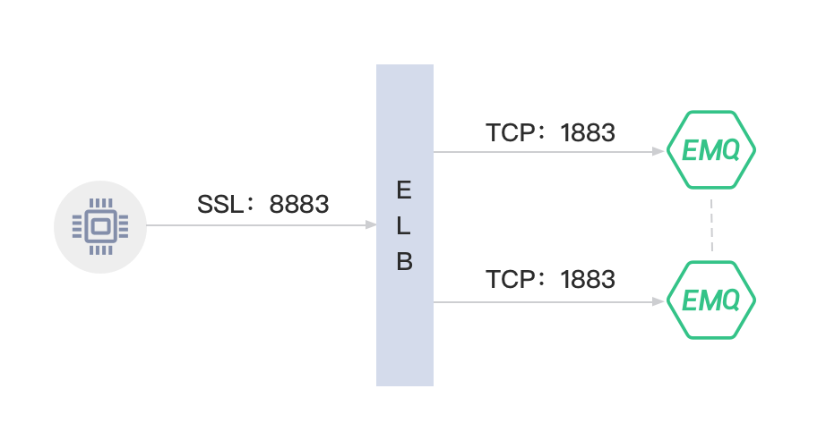

---
# 编写日期
date: 2020-02-07 17:15:26
# 作者 Github 名称
author: wivwiv
# 关键字
keywords:
# 描述
description:
# 分类
category: 
# 引用
ref:
---

# 生产部署

在开发时我们通常使用压缩包方式以单节点的形式启动服务，生产运行需要一个更加简单稳定的方式。本页主要从部署架构最佳实践讲解如何部署你的 EMQ X 服务。

::: tip
如果 EMQ X 集群部署在 HAProxy 或 Nginx 后，且需要拿到客户端真实的源 IP 地址与端口，则需打开 Proxy Protocol 配置，配置项：[EMQ X 监听器 proxy_protocol](../configuration/configuration.md#listenertcpexternalproxyprotocol)

`Proxy Protcol` 参考: [https://www.haproxy.com/blog/haproxy/proxy-protocol](https://www.haproxy.com/blog/haproxy/proxy-protocol)。

Nginx 使用 Proxy Prorcol 参考: [https://docs.nginx.com/nginx/admin-guide/load-balancer/using-proxy-protocol/](https://docs.nginx.com/nginx/admin-guide/load-balancer/using-proxy-protocol/)

:::


## 部署架构

EMQ X 集群可作为物联网接入服务（IoT Hub）部署，目前 EMQ 在青云、阿里云、AWS 等云服务提供商上均提供开箱即用的免费软件镜像，对于特殊硬件平台和系统版本如树莓派、Linux ARM，可使用源码编译安装。

典型部署架构：


### LB (负载均衡)

LB (负载均衡器) 负责分发设备的 MQTT 连接与消息到 EMQ X 集群，LB 提高 EMQ X 集群可用性、实现负载平衡以及动态扩容。

部署架构推荐在 LB 终结 SSL 连接。设备与 LB 之间 TLS 安全连接，LB 与 EMQ X 之间普通 TCP 连接。这种部署模式下 EMQ X 单集群可轻松支持 100 万设备。

公有云厂商 LB 产品:

| 云计算厂商                       | 是否支持 TLS 终结 | LB 产品介绍                                                |
| -------------------------------- | ----------------- | ---------------------------------------------------------- |
| [青云](https://qingcloud.com)    | 是                | <https://docs.qingcloud.com/product/network/loadbalancer/> |
| [AWS](https://aws.amazon.com)    | 是                | <https://aws.amazon.com/cn/elasticloadbalancing/>          |
| [阿里云](https://www.aliyun.com) | 否                | <https://www.aliyun.com/product/slb>                       |
| [UCloud](https://ucloud.cn)      | 未知              | <https://ucloud.cn/site/product/ulb.html>                  |
| [QCloud](https://www.qcloud.com) | 未知              | <https://www.qcloud.com/product/clb>                       |

私有部署 LB 服务器:

| 开源 LB                            | 是否支持 TLS 终结 | 方案介绍                                                |
| ---------------------------------- | ----------------- | ------------------------------------------------------- |
| [HAProxy](https://www.haproxy.org) | 是                | <https://www.haproxy.com/solutions/load-balancing.html> |
| [NGINX](https://www.nginx.com)     | 是                | <https://www.nginx.com/solutions/load-balancing/>       |


::: tip

国内公有云部署推荐青云 (EMQ X 合作伙伴)，国外部署推荐 AWS ，私有部署推荐使用 HAProxy 作为 LB。

:::


### EMQ X 集群

EMQ X 节点集群部署在 LB 之后，建议部署在 VPC 或私有网络内。公有云厂商青云、AWS、UCloud、QCloud 均支持 VPC 网络。

EMQ X 默认开启的 MQTT 服务 TCP 端口:

| 端口  | 说明                    |
| ----- | ----------------------- |
| 1883  | MQTT 协议端口           |
| 8883  | MQTT/SSL 端口           |
| 8083  | MQTT/WebSocket 端口     |
| 8084  | MQTT/WebSocket/SSL 端口 |
| 8081  | 管理 API 端口           |
| 18083 | Dashboard 端口          |

防火墙根据使用的 MQTT 接入方式，开启上述端口的访问权限。


EMQ X 节点集群使用的 TCP 端口:

| 端口 | 说明                    |
| ---- | ----------------------- |
| 4369 | 集群节点发现端口 (EPMD) |
| 4370 | 集群节点发现端口        |
| 5369 | 集群节点 PRC 通道       |
| 6369 | 集群节点控制通道        |

集群节点间如有防护墙，需开启上述 TCP 端口互访权限。

## 青云 (QingCloud) 部署

1. 创建 VPC 网络。

2. VPC 网络内创建 EMQ X 集群 ' 私有网络 '，例如: 192.168.0.0/24

3. 私有网络内创建两台 EMQ X 主机，例如:
  
| 节点  | IP 地址     |
| ----- | ----------- |
| emqx1 | 192.168.0.2 |
| emqx2 | 192.168.0.3 |


4. 安装并集群 EMQ X 主机，具体配置请参考安装集群章节。

5. 创建 LB (负载均衡器) 并指定公网 IP 地址。

6. 在 LB 上创建 MQTT TCP 监听器:



或创建 SSL 监听器，并终结 SSL 在 LB :


7. MQTT 客户端连接 LB 公网地址测试。


## 亚马逊 (AWS) 部署

1. 创建 VPC 网络。

2. VPC 网络内创建 EMQ X 集群 ' 私有网络 '，例如: 192.168.0.0/24

3. 私有网络内创建两台 EMQ X 主机，指定上面创建的 VPC 网络，例如:
  
| 节点  | IP 地址     |
| ----- | ----------- |
| emqx1 | 192.168.0.2 |
| emqx2 | 192.168.0.3 |


4. 在安全组中，开放 MQTT 服务的 TCP 端口，比如 1883, 8883。

5. 安装并集群 EMQ X 主机，具体配置请参考安装集群章节。

6. 创建 ELB (Classic 负载均衡器)，指定 VPC 网络，并指定公网 IP 地址。

7. 在 ELB 上创建 MQTT TCP 监听器:


或创建 SSL 监听器，并终结 SSL 在 LB :



8. MQTT 客户端连接 LB 公网地址测试。


## 私有网络部署

### EMQ X 集群直连

EMQ X 集群直接挂 DNS 轮询，设备通过域名或者 IP 地址列表访问:

1. 部署 EMQ X 集群
2. EMQ X 节点防火墙开启外部 MQTT 访问端口，例如 1883, 8883
3. 设备通过 IP 地址列表或域名访问 EMQ X 集群

::: tip
产品部署不推荐这种部署方式。
:::

### HAProxy 负载均衡

HAProxy 作为 LB 部署 EMQ X 集群，并终结 SSL 连接:

1. 创建 EMQ X 集群节点，例如:

| 节点  | IP 地址     |
| ----- | ----------- |
| emqx1 | 192.168.0.2 |
| emqx2 | 192.168.0.3 |

2. 配置 /etc/haproxy/haproxy.cfg，示例：
  
```yaml
listen mqtt-ssl
  bind *:8883 ssl crt /etc/ssl/emqx/emq.pem no-sslv3
  mode tcp
  maxconn 50000
  timeout client 600s
  default_backend emqx_cluster
        
backend emqx_cluster
  mode tcp
  balance source
  timeout server 50s
  timeout check 5000
  server emqx1 192.168.0.2:1883 check inter 10000 fall 2 rise 5 weight 1
  server emqx2 192.168.0.3:1883 check inter 10000 fall 2 rise 5 weight 1
```


### Nginx 负载均衡

Nginx 产品作为 EMQ X 集群 LB，并终结 SSL 连接:

1. 创建 EMQ X 节点集群，例如:

| 节点  | IP 地址     |
| ----- | ----------- |
| emqx1 | 192.168.0.2 |
| emqx2 | 192.168.0.3 |

3. 配置 /etc/nginx/nginx.conf，示例:
  
```bash
stream {
  upstream stream_backend {
      zone tcp_servers 64k;
      hash $remote_addr;
      server 192.168.0.2:1883 max_fails=2 fail_timeout=30s;
      server 192.168.0.3:1883 max_fails=2 fail_timeout=30s;
  }

  server {
      listen 8883 ssl;
      status_zone tcp_server;
      proxy_pass stream_backend;
      proxy_buffer_size 4k;
      ssl_handshake_timeout 15s;
      ssl_certificate     /etc/emqx/certs/cert.pem;
      ssl_certificate_key /etc/emqx/certs/key.pem;
  }
}
```
